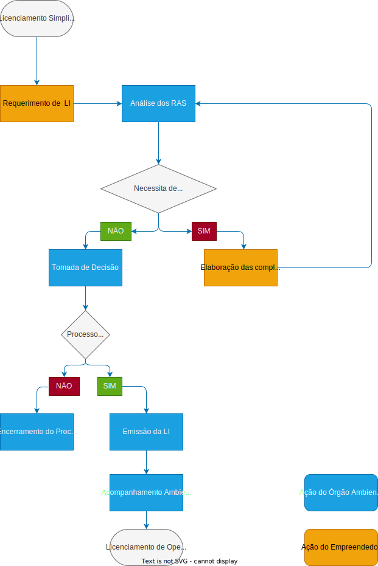

# Licenciamento Ambiental da Infraestrutura de Transportes

## Rodovias
Legislação específicas para o modal rodoviário

<table>
    <tr>
        <th>
            LEGISLAÇÃO ESPECÍFICA
        </th>
        <th>
            DESCRIÇÃO
        </th>
    </tr>
    <tr>
        <td>
            Portaria Interministerial MMA/MInfra nº 01/2020
        </td>
        <td>
            Dispõe sobre a regularização ambiental federal de Rodovias Federais pavimentadas.
        </td>
    </tr>
    <tr>
        <td>
            Instrução Normativa Ibama nº 13/2013
        </td>
        <td>
            Padronização metodológica dos planos de amostragem de fauna.
        </td>
    </tr>
</table>

### Procedimento Específico
A portaria MMA/INFRA nº 01/2020 estabelece procedimentos de licenciamento ambiental a serem utilizados pelo IBAMA, para proceder com a regularização de rodovias federais pavimentadas.


- A FCA e Requerimento de AO devem ser enviados via SEI (Sistema Eletrônico de Informação).
- Na impossibilidade de adequação do objeto ao enquadramento, na fase de análise da FCA, o IBAMA informará ao empreendedor o tipo de licenciamento adequado para aquela atividade ou empreendimento.
- Caso haja supressão de vegetação, deverá ser solicitada a Autorização de Supressão de Vegetação - ASV - via SINAFLOR
- **AO:** Autorização de Operação, cujo modelo de requerimento é anexo a Portaria.
- **RFAR:** Relatório Anual de Regularização Ambiental.

O empreendedor poderá solicitar a LO a qualquer momento durante o processo de regularização, devendo representar requerimento de LO e o RFAR.

### ORGÃOS INTERVENIENTES
Cabe ao IBAMA informar da emissão de AO, em até 15 dias após a emissão da autorização, os órgãos e entidades citados na Portaria Interministerial MMA/MJ/MinC/MS nº 60/2015 ou aqueles que tenham sucedido à competência definida na normativa e aos órgãos gestores de UCs conforme previsto no Art. 5º da Resolução CONAMA nº428/2010

### PROGRAMAS AMBIENTAIS
A AO demanda a execução dos seguintes Programas Ambientais para operação da rodovia e atividades rodoviárias:
- Programa Ambiental de construção.
- Programa de monitoramento, prevenção e controle de processos erosivos.
- Programa de supressão de vegetação e afungentamento de fauna.
- Programa de recuperação de áreas degradadas.
- Programa de monitoramento, prevenção e controle de atropelamentos de fauna silvestre.
- Programa de recuperação/mitigação de passivos ambientais.

As medidas devem ser diretamente relacionadas e proporcionais aos impactos da atividade/empreendimento.

### RELATÓRIO ANUAL DE REGULARIZAÇÃO AMBIENTAL (RARA)
O RARA deverá ser encaminhado ao IBAMA, pelo empreendedor, até o dia 30 de junho de cada ano. As informações compreendem o período entre janeiro e dezembro do ano civil anterior ao da apresentação do Relatório Anual.

Será utilizado como instrumento base de controle para as atividades de supervisão, acompanhamentos e auditagem, podendo o IBAMA, a qualquer tempo, realizar vistorias de acompanhamento dos empreendimentos ou atividades.

#### Autorização de Operação - AO
É o ato autoritativo precário e transitório da operação de empreendimento ou atividade e que estabelece as medidas necessárias para emissão de LO.

A emisão de AO de rodovias federais pavimentadas autoriza as seguintes atividades:
- Manutenção.
- Melhoramento.
- Instalação de estruturas de apoio à execução das atividades de manutenção, melhoramentos e ações urgentes/emergenciais.
- Ações urgentes e/ou emergenciais.
- Manejo de fauna necessária a execução das atividades descritas acima, sendo vedada a coleta de fauna silvestre para fins de coleção.

Exemplos de atividade de **manutenção**
```txt
Limpeza, capina e roçada da faixa de domínio

Remoção de barreiras de corte

Remendos superficiais e profundos
```

Exemplos de atividade de **melhoramentos**
```txt
Implantação de vias marginais em travessias urbanas

Implantação de estruturas de fibra óptica a serem utilizadas para a operação rodoviária

Alargamento da plataforma da rodovia para implantação de acostamento e de 3ª faixa
```

Ações **urgentes/emergenciais**
<table>
    <tr>
        <th>TIPO DE AÇÃO</th>
        <th>DESCRIÇÃO</th>
    </tr>
    <tr>
        <td>Ações urgentes</td>
        <td>Intervenções requeridas quando há indicios de iminente ameaça de dano ou comprometimento que possa restringir a segurança de tráfego ou provocar danos ao meio ambiente e a terceiros.</td>
    </tr>
    <tr>
        <td>Ações emergenciais</td>
        <td>Intervenções que se destinam a recompor, reconstruir ou restaurar taludes, trechos rodoviários e obras de arte especiais que tenham sido seccionados, obstruídos ou danificados por evento extraordinário ou catastrófico, ocasionando a interrupção do tráfego ou colocando flagrante risco em seu desenvolvimento.</td>
    </tr>
</table>

## FERROVIAS
<table>
    <tr>
        <th>LEGISLAÇÃO ESPECÍFICA</th>
        <th>DESCRIÇÃO</th>
    </tr>
    <tr>
        <td>Resolução Conama nº479/2017</td>
        <td>Trata sobre o licenciamento ambiental de empreendimentos ferroviários de baixo potencial de impacto ambiental e a regularização dos empreendimentos de operação.</td>
    </tr>
    <tr>
        <td>Instrução Normativa IBAMA nº13/2013</td>
        <td>Estabelece padronização metodológica dos planos de amostragem de fauna exigidos nos estudos ambientais necessários para o licenciamento ambiental de rodovias e ferrovias. A padronização também se aplica à etapa de monitoramento, após a emissão de LI, devendo continuar a ser adotada após emissão de LO, caso haja atividades de monitoramento previstas para essa etapa.</td>
    </tr>
</table>

### Procedimento simplificado
É definido pela Resolução CONAMA nº479/2017. 

De forma geral, os procedimentos administrativos para a obtenção do licenciamento ambiental específico são semelhantes ao processo ordinário. As diferenças são mais presentes nos tipos de estudo ambientais solicitados e nas fases de licenciamento, pois na maioria das casos as fases são suprimidas ou agregadas.

#### Atividades e obras de baixo potencial de impacto ambiental

<table>
    <tr>
        <th colspan="2">OBRAS FERROVIARIAS CONSIDERADAS DE BAIXO IMPACTO AMBIENTAL - CONAMA Nº479/17</th>
    </tr>
    <tr>
        <td><strong>Unidades de apoio necessárias à operação ferroviária</strong></td>
        <td>
            <ul>
                <li>Pátios para formação, manobras, transbordo e cruzamentos de trens</li>
                <li>Oficinas, postos de manutenção de material rodante (locomotivas e vagões) e suas estruturas (Estação de Tratamento de efluentes - ETE, Separador de Água e Óleo - SAO, armazenamento temporário de resíduos sólidos, entre outros.)</li>
                <li>Usinas de tratamento de dormentes</li>
                <li>Oficinas de manutenção de equipamentos de via permanente</li>
                <li>Postos de abastecimento</li>
                <li>Estaleiro de soldagem de trilhos</li>
                <li>Estações de controle de tráfego, estações de passageiros, estações de controle de carga e descarga</li>
                <li>Subestações elétricas e de comunicação</li>
                <li>Terminais de cargas</li>
                <li>Cabine de teste de potência de locomotivas</li>
                <li>Lavadores de vagões e locomotivas</li>
                <li>Areeiro</li>
                <li>Cabine de pintura</li>
            </ul>
        </td>
    </tr>
    <tr>
        <td><strong>Serviços e obras de rotina</strong></td>
        <td>Atividades sistemáticas de manutenção e reparação da integridade de estruturas já existentes, bem como outras necessárias à manutenção da segurança operacional da via e à conservação ambiental, não incluindo obras de aumento de capacidade, incluídas as atividades exemplificadas no anexo l da Resolução Conama nº 479/2017</td>
    </tr>
    <tr>
        <td><strong>Atividades de melhoramentos</strong></td>
        <td>Obras relacionadas à reforma da linha férrea e das estruturas que a compõe, ou seja, um conjunto de intervenções que modificam as características técnicas existentes ou acrescentam características novas na sua geometria, sistema de sinalização e segurança e adequação ou incorporação de elementos nos demais componentes do sistema ferroviário, não incluindo obras de duplicação; e obras de transposição de linha férrea em locais onde há cruzamento entre ferrovia e vias públicas, tais como viadutos ferroviários ou rodoviários, passarelas, tubulações de água, esgoto ou drenagem</td>
    </tr>
</table>

#### Licenciamento Ambiental Simplificado
Os empreendimentos e atividades de baixo potencial de impacto ambiental ficam sujeitos ao licenciamento ambiental com base em procedimento simplificado.



O procedimento simplificado em questão será iniciado pela apresentação do requerimento de Licença de Instalaçao.

O requerimento deverá compor as seguintes informações:
- Documentos e/ou autorizações legais exigidos.
- RAS - Relatório Ambiental Simplificado, elaborado com base em dados secundários e de monitoramento existentes, a partir do termo de referência padrão, estabelecido pelo órgão ambiental competente.

O prazo para análise dos estudos ambientais é de 90 dias. Ao final da análise deverá ser emitido um parecer técnico conclusivo.

<table>
    <tr>
        <th>FASE DO LICENCIAMENTO</th>
        <th>DESCRIÇÕES</th>
    </tr>
    <tr>
        <td>Instauração de Processo</td>
        <td>
            <ul>
                <li>Abertura de Processo</li>
                <li>Ficha de Caracterização de Atividade (FCA)</li>
                <li>Análise de Competência</li>
                <li>Enquadramento do empreendimento</li>
            </ul>
        </td>
    </tr>
    <tr>
        <td>Licenciamento de Instalação</td>
        <td>
            <ul>
                <li>Relatório Ambiental Simplificado (RAS)</li>
                <li>Tomada de Decisão</li>
            </ul>
        </td>
    </tr>
    <tr>
        <td>Licenciamento de Operação</td>
        <td>
            <ul>
                <li>Elaboração dos documentos em atendimento aos requisitos da LI</li>
                <li>Elaboração dos Programas de Controle Ambiental (PBA ou PGA)</li>
                <li>Análise de Documentos</li>
                <li>Tomada de decisão</li>
            </ul>
        </td>
    </tr>
</table>

### Serviços e obras de rotina
São atividades sistemáticas de manutenção e reparação da integridade de estruturas já existentes, bem como outras necessárias à manutenção da segurança operacional da via e à conservação ambiental, não incluindo obras de aumento de capacidade, incluídas as atividades exemplificadas no [anexo I da Resolução CONAMA nº479/2017.](https://diariofiscal.com.br/ZpNbw3dk20XgIKXVGacL5NS8haIoH5PqbJKZaawfaDwCm/legislacaofederal/resolucao/2017_conama479.html)

[Anexo I no repositório](./assets/anexoIRCON.md)

### Atividades de Melhoramentos
<table>
    <tr>
        <th colspan="2">ATIVIDADES DE MELHORAMENTOS</th>
    </tr>
    <tr>
        <th>TIPO DE OBRA</th>
        <th>ESPECIFICAÇÃO DA ATIVIDADE</th>
    </tr>
    <tr>
        <td>Obras relacionadas à reforma da linha férrea e das estruturas que a compõe</td>
        <td>Conjunto de intervenções que modificam as características técnicas existentes ou acrescentam características novas na sua geometria, sistema de sinalização e segurança e adequação ou incorporação de elementos nos demais componentes do sistema ferroviário, não incluindo obras de duplicação</td>
    </tr>
    <tr>
        <td>Obras de transposição de linha férrea</td>
        <td>Em locais onde há cruzamento entre ferrovia e vias públicas, tais como viadutos ferroviários ou rodoviários, passarelas, tubulações de água, esgoto ou drenagem</td>
    </tr>
</table>

### Orientações Gerais
Essas atividades ficam autorizadas pela LO, desde que respeitadas as condicionantes presentes na mesma.

Apesar do enquadramento no procedimento simplificado, o empreendedor deverá observar todos os normativos, sejam eles municipais, estaduais ou federais, incluindo a necessidade de obtenção de outras autorizações.

## Aeroportos
<table>
    <tr>
        <th colspan="2">LEGISLAÇÃO ESPECÍFICA</th>
    </tr>
    <tr>
        <td>Resolução Conama nº 470/2015</td>
        <td>A Resolução Conama nº 470, de agosto de 2015, estabelece critérios e diretrizes para o licenciamento ambiental dos aeroportos regionais. As definições desta resolução serão tratadas no decorrer deste capítulo.</td>
    </tr>
    <tr>
        <td>Resolução Conama nº 466/2015</td>
        <td>A Resolução CONAMA nº 466, de 05 de fevereiro de 2015, estabelece diretrizes e procedimentos para elaboração e autorização do Plano de Manejo de Fauna em Aeródromos (PMFA), definido pela Lei nº 12.725, de 16 de outubro de 2012. O órgão ambiental deverá ser consultado pelo empreendedor sobre a necessidade da referida autorização sempre que houver atividades de manejo de fauna no respectivo empreendimento.</td>
    </tr>
    <tr>
        <td>Resolução Brasileira da Aviação Civil – RBAC 161</td>
        <td>A Resolução Brasileira da Aviação Civil – RBAC 161 estabelece para os operadores de aeródromos civis, os requisitos de elaboração e aplicação do Plano de Zoneamento de Ruído – PZR e define critérios técnicos aplicáveis na análise de questões relacionadas ao ruído aeronáutico na aviação civil.</td>
    </tr>
    <tr>
        <td>Resolução Brasileira da Aviação Civil – RBAC 153 – Subparte H</td>
        <td>A Resolução define que o operador de aeródromo deve estabelecer e implementar procedimentos básicos de gerenciamento do risco da fauna que sejam capazes de mitigar o risco de colisão entre aeronaves e a fauna. Desta forma, descreve a metodologia para elaboração do Estudo de Identificação da Fauna (Diagnóstico detalhado e análise de risco de ocorrências de colisão de fauna), assim como do Plano de Gerenciamento do Risco da Fauna (Procedimento específico para controle de fauna em aeroporto). Estes devem ser submetidos a análise e aprovação da ANAC.</td>
    </tr>
</table>

### Procedimento Simplificado – Ampliação e Construção de Aeroportos Regionais
É definido pela Resolução CONAMA nº 470/2015, desta forma, considara-se a seguinte definição:

Aeroporto com movimentação anual de passageiros embarcados e desembarcados inferior a:
- 800.000 passageiros por ano, quando localizado na Região da Amazônia Legal;
- 600.000 passageiros por ano, quando localizado nas demais regiões do país;

### Enquadramento de Baixo Potencial de Impacto Ambiental
A ampliação e construção de novos aeroportos são consideradas de baixo potencial de impacto se estiver no seguinte enquadramento:

1. Não se localize em zonas de amortecimento de unidades de conservação de proteção integral, adotando-se o limite de 3Km a partir do limite da unidade de conservação, cuja zona de amortecimento não esteja ainda estabelecida.
2. Não implique em:
   1. Corte e supressão de vegetação primária e secundária no estágio avançado de regeneração, no bioma Mata Atlântica, conforme Lei nº 11.428, de 22 de dezembro de 2006, ou outros biomas protegidos por leis específicas.
3. Sobreposição com áreas regulares de pouso, descanso, alimentação e reprodução de aves migratórias, constantes no Relatório Anual de Rotas e Áreas de Concentração de Aves Migratórias no Brasil publicado pelo ICMBIO.
4. Sobreposição com áreas sensíveis de espécies ameaçadas de extinção, constantes no Relatório de Áreas Sensíveis de Espécies Ameaçadas de Extinção Relacionadas a Aeroportos, para fins de operação de aeroportos regionais.


### Procedimento Simplificado
O procedimento simpificado deverá ser instruído da seguinte forma:

1. Estudo preliminar de engenharia, contendo no mínimo, a localização, descrição e as plantas da situação existente e das atividades a serem executadas, bem como a respectiva Anotação de Responsabilidade Técnica - ART
2. Relatório Ambiental Simplificado - RAS
3. Documentos, autorizações e outorgas legalmente exigíveis, conforme o caso, por força das normas federais, estaduais e municipais circunscritas ao licenciamento ambiental.
4. Requerimento de autorização de supressão de vegetação devidamente instruído, quando couber.
5. Manifestação do órgão municipal competente, quanto ao use e ocupação do solo.

O Relatório Ambiental Simplificado (RAS) tem como objetivo oferecer elementos para a análise de viabilidade ambiental de empreendimentos ou atividades consideradas de baixo impacto ambiental.

O Termo de Referência para elaboração do RAS pode está definido no anexo II da Resolução CONAMA nº 470/2015.

O órgão ambiental licenciador analisará os documentos no prazo de **180 dias**, contados a partir da data de entrada no protocolo. 

### Licença de Operação – Atividades que poderão ser autorizadas
De acordo com a Resolução CONAMA nº 470/2015, as LOs poderão autorizar as seguintes atividades:

1. Poda de vegetação que coloque em risco a operação aeroportuária
2. Controle de plantas invasoras, inclusive com o uso de herbicidas específicos, devidamente registrados perante órgãos competentes, observados os instrumentos normativos pertinentes ao emprego de produtos tóxicos.
3. Limpeza e reparo de sistemas de drenagem, bueiros ou similares.
4. Implantação de cercas, defensas metálicas ou similares.
5. Reparos e manutenção em obras de arte.
6. Melhorias ou modernizações em estruturas aeroportuárias, que não impliquem ampliação.

## Portos

### Definições específicas
A seção define conceitos fundamentais relacionados à infraestrutura portuária, como:  
- **Porto Organizado**: áreas sob jurisdição de uma autoridade portuária, incluindo instalações terrestres e aquaviárias.  
- **Infraestrutura Portuária**: elementos como cais, píeres, armazéns, vias internas, bacias de evolução e canais de acesso.  
- **Operação Portuária**: movimentação e armazenamento de mercadorias no transporte aquaviário.  
Esses conceitos ajudam a contextualizar a regulamentação ambiental do setor.

### Procedimento Específico
As Portarias MMA nº 424/2011 e nº 425/2011 regulam o licenciamento ambiental de portos e terminais, incluindo a criação do Programa Federal de Apoio à Regularização e Gestão Ambiental Portuária (PRGAP). O procedimento prevê etapas como adequação à legislação, apresentação de relatórios e atendimento às condicionantes ambientais.

### Procedimento para Regularização Ambiental
O processo envolve a entrega de documentos como a Ficha de Caracterização da Atividade (FCA), Autorização de Operação (AO) e Relatório Final de Atividades de Regularização (RFAR). A análise pelo Ibama considera o cumprimento de programas ambientais para emissão de Licença de Operação (LO).

### Outorgas de Direitos de Uso de Recursos Hídricos
Atividades que alterem o regime de recursos hídricos, como extração de águas subterrâneas, lançamento de efluentes ou captação de água, exigem outorga do Poder Público. Essa medida visa regular o uso sustentável dos recursos hídricos.

### Outras autorizações
Antes do início de obras sobre ou sob águas, como cais ou molhes, o empreendedor deve obter parecer favorável da Marinha do Brasil, que avalia impactos na segurança da navegação e no ordenamento aquaviário.

### Cais, Molhes, Trapiches e Similares
Construções sobre águas podem causar impactos significativos, como assoreamento e mudanças no regime hídrico. Projetos que envolvam estruturas sólidas requerem estudos específicos de engenharia costeira para avaliação dos impactos. Obras sobre estacas, como trapiches, são menos exigentes, mas ainda precisam de parecer técnico.
