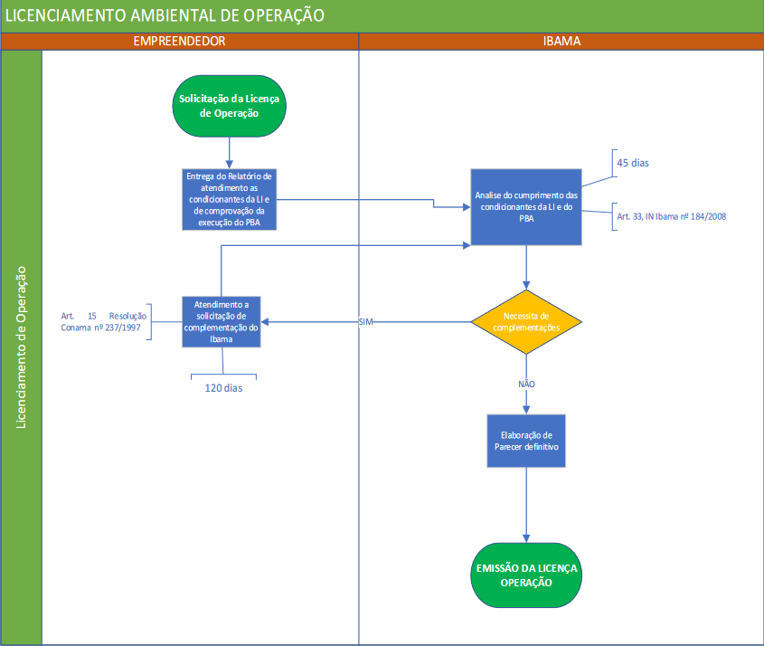

# Rito Ordinário de Licenciamento Ambiental
## Licenças Ambientais

Conforme a **CONAMA** nº 237/1997, a licença ambiental é um **ato administrativo** onde o órgão ambiental responsável, INCRA por exemplo, estabelece restrições e medidas que devem ser respeitadas pelo empreendedor, pessoa física ou jurídica antes de ampliar/operar empreendimentos ou atividades que utilizem de recursos ambientais ou sejam julgadas um **risco** para o meio ambiente.

Em regra, o LAF no Brasil possui 3 fases distintas:

## Fases do LAF
- Instauração do Processo
   1. [Abertura de Processo](https://www.gov.br/ibama/pt-br/assuntos/laf/procedimentos-e-servicos/etapas/abertura-de-processo)
   1. [Triagem e Enquadramento](https://www.gov.br/ibama/pt-br/assuntos/laf/procedimentos-e-servicos/etapas/triagem-e-enquadramento)
   1. [Definição de Escopo](https://www.gov.br/ibama/pt-br/assuntos/laf/procedimentos-e-servicos/etapas/definicao-de-escopo)
   1. [Elaboração do Estudo Ambiental](https://www.gov.br/ibama/pt-br/assuntos/laf/procedimentos-e-servicos/etapas/elaboracao-do-estudo-ambiental)
   1. [Requerimento de Licença](https://www.gov.br/ibama/pt-br/assuntos/laf/procedimentos-e-servicos/etapas/requerimento-de-licenca)
   1. [Análise Técnica](https://www.gov.br/ibama/pt-br/assuntos/laf/procedimentos-e-servicos/etapas/analise-tecnica)
   1. [Decisão](https://www.gov.br/ibama/pt-br/assuntos/laf/procedimentos-e-servicos/etapas/tomada-de-decisao)
   1. [Pagamento](https://www.gov.br/ibama/pt-br/assuntos/laf/procedimentos-e-servicos/etapas/pagamento)
   1. [Acompanhamento](https://www.gov.br/ibama/pt-br/assuntos/laf/procedimentos-e-servicos/etapas/acompanhamento)
- Licenciamento Prévio (Licença Prévia LP)

    Concedida na fase preliminar do planejamento do empreendimento ou atividade aprovando sua localização e concepção, atestando a viabilidade ambiental e estabelecendo os requisitos básicos e condicionantes a serem atendidos nas próximas fases de sua implementação.
- Licenciamento de Instalação (Licença de Instalação LI)

    Autoriza a instalação do empreendimento ou atividade de acordo com as especificações constantes dos planos, programas e projetos aprovados, incluindo as medidas de controle ambiental e demais condicionantes.
- Licenciamento de Operação (Licença de Operação LO)

    Autoriza a operação da atividade ou empreendimento, com as medidas de controle ambiental e condicionantes determinados para a operação.

- Fases gerais (encontradas no site do [IBAMA](https://www.gov.br/ibama/pt-br/assuntos/laf/sobre))
    - (LPS) Licença de Pesquisa Sísmica

    A LPS autoriza pesquisa de dados sísmicos marítimos e em zonas de transição e estabelece condições, restrições e medidas de controle ambiental que devem ser seguidas pelo empreendedor para realizar essas atividades.
    - (AO) Autorização de Operação
    
    Ato autorizativo precário e transitório de operação de empreendimentos ou atividade e que estabelece medidas necessárias à expedição de Licença de Operação.
    - (ASV) Autorização de Supressão de Vegetação
    
    Autoriza as atividades de supressão de vegetação nativa p/ instalação e operação dos projetos licenciados.
    - (Abio) Autorização para coleta, captura e transporte de material Biológico

    Autoriza a execução de atividades relacionadas ao manejo de fauna durante a fase prévia, de instalação ou operação do projeto licenciado.

    obs:
        
        Neste contexto, cada órgão ambiental licenciador de acordo com sua discricionariedade também pode variar as nomenclaturas para cada etapa. - PDF Módulo II -

## Abertura do processo
O processo inicia-se por meio do formulário de caracterização de atividade (FCA). As informações que compõem o FCA auxiliam o Ibama nas etapas de triagem e definição do escopo. Após seu envio é instaurado processo administrativo no Ibama. 

O empreendedor deverá realizar o requerimento conforme a resolução **CONAMA nº6/1986**.

## Análise de Competência e Triagem

Nessa etapa, o Ibama avalia se a atividade ou empreendimento deve ser submetido ao LAF, em caso positivo, defique quais os procedimentos serão adotados.

Primeiro é avaliado se a competência para conduzir o licenciamenento da atividade ou empreendimento é federal e se é sujeita ao licenciamento ambiental. Caso seja concluído que a competência não é do Ibama ou que não é sujeito ao licenciamento ambiental, o interessado será comunicado sobre o resultado e sobre a decisão de arquivamento do processo administrativo.

Caso sejam sujeitos ao LAF, o Ibama realiza o enquadramento desses quanto ao potencial de causar degradação ambiental. Caso seja de competência do estado ou município, oprocesso deve ser encaminhado pelo empreendedor para o órgão ambiental competente.

## Definição de escopo
Fase de elaboração do [Termo de Referência](#termo-de-referência) (TR). Devem ser analisados os potenciais impactos ambientais da atividade ou empreendimento, os principais aspectos associados a esses impactos e então se definem critérios e o conteúdo mínimo para a elaboração do estudo ambiental.

## Órgãos Intervenientes

<table>
    <tr>
        <th>
            Órgão Envolvido
        </th>
        <th>
            Situações que exigirão a participação dos órgãos envolvidos
        </th>
    </tr>
    <tr>
        <td>
            Iphan
        </td>
        <td>
            Empreendimentos que impactem bens culturais acautelados, conforme Portaria Interministerial MMA/MJ/MC/MS nº 60/2015.
        </td>
    </tr>
    <tr>
        <td>
            Funai
        </td>
        <td>
            Empreendimentos que impactem terras indígenas, conforme Portaria Interministerial MMA/MJ/MC/MS nº 60/2015.
        </td>
    </tr>
    <tr>
        <td>
            INCRA
        </td>
        <td>
            Empreendimentos que impactem terras quilombolas, conforme Portaria Interministerial MMA/MJ/MC/MS nº 60/2015.
        </td>
    </tr>
    <tr>
        <td>
            ICMBIO
        </td>
        <td>
            Empreendimentos que impactem unidades de conservação instituídas pela União, conforme Resolução Conama nº 428/2010 e Instrução Normativa Conjunta ICMBio/Ibama nº 08/2019.
        </td>
    </tr>
    <tr>
        <td>
            Gestores Estaduais ou Municipais de Unidades de Conservação
        </td>
        <td>
            Empreendimentos que impactem unidades de conservação instituídas pelos estados e municípios, conforme Resolução Conama nº 428/2010.
        </td>
    </tr>
    <tr>
        <td>
            Ministério da Saúde
        </td>
        <td>
            Empreendimentos que estiverem localizados em regiões endêmicas de malária, conforme Portaria Interministerial MMA/ MJ/MC/MS nº 60/2015.
        </td>
    </tr>
</table>

## Termo de Referência
É o instrumento que define os critérios e o conteúdo mínimo para a elaboração do estudo ambiental.

O órgão ambiental disponibiliza um Termo de Referência Padrão da tipologia específica do empreendimento.

Após a finalização dos trâmites necessários o órgão ambiental irá encaminhar ao empreendedor o Termo de Referência definitivo.

O prazo de validade do TR é de 2 anos e pode ser renovado a pedido do empreendedor e a critério do órgão ambiental.

## Contéudo do Estudo de Impactro Ambiental (EIA)
O art. 2º da Resolução CONAMA nº 01/86 define diversas atividades que necessitam da elaboração de EIA, porém se formos destacar as atividades relacionadas a infraestrutura de transportes temos:

- Estradas de rodagem com duas ou mais faixas de rolamento;
- Ferrovias;
- Portos e terminais de minério, petróleo e produtos químicos;
- Aeroportos

As diretrizes gerais que devem compor um EIA são:

1. Contemplar todas as alternativas tecnológicas e de localização do projeto,
confrontando-as com a hipótese de não execução do projeto;

1. Identificar e avaliar sistematicamente os impactos ambientais gerados nas fases de
implantação e operação da atividade;

1. Definir os limites da área geográfica a ser direta ou indiretamente afetada pelos
impactos, denominada área de influência do projeto, considerando, em todos os
casos, a bacia hidrográfica na qual se localiza;

1. Considerar os planos e programas governamentais, propostos e em implantação na
área de influência do projeto, e sua compatibilidade.

O EIA deverá conter, no mínimo, as seguintes atividades técnicas, conforme Resolução CONAMA nº 01/1986:

1. Diagnóstico ambiental da área de influência do projeto completa, descrição e análise dos recursos ambientais e suas interações.
   - O meio físico - o subsolo, as águas, o ar e o clima, destacando os recursos minerais, a topografia, os tipos e aptidões do solo, os corpos d'água, o regime hidrológico, as correntes marinhas, as correntes atmosféricas;
   - O meio biológico e os ecossistemas naturais - a fauna e a flora, destacando as espécies indicadoras da qualidade ambiental, de valor científico e econômico, raras e ameaçadas de extinção e as áreas de preservação permanente;
   - O meio socioeconômico - o uso e ocupação do solo, os usos da água e a socioeconomia,  destacando os sítios e monumentos arqueológicos, históricos e culturais da comunidade, as relações de dependência entre a sociedade local, os recursos ambientais e a potencial utilização futura desses recursos
3. Análise dos impactos ambientais do projeto e de suas alternativas.
3. Definição das medidas mitigadoras dos impactos negativos.
4. Elaboração do programa de acompanhamento e monitoramentodos impactos.

De acordo com os Termos de Referência para Estudo de Impacto Ambiental do IBAMA, apresentamos a tabela como exemplo da estrutura básica dos empreendimentos de Infra dos Transportes.

<table>
    <tr>
        <th>
        TÓPICO
        </th>
        <th>
        SUBTÓPICO
        </th>
    </tr>
    <tr>
        <td>
        INTRODUÇÃO
        </td>
    </tr>
    <tr>
        <td>
        IDENTIFICAÇÃO
        </td>
        <td>
        Identificação do empreendedor 
          
        Identificação da empresa de Consultoria
        </td>
    </tr>
    <tr>
        <td>
        CARACTERIZAÇÃO DO EMPREENDIMENTO / ATIVIDADE
        </td>
        <td>
        Canteiro de obras e Infra de Apoio
         
        Insumos e Utilidade
         
        Acesso e Rotas
         
        Mão de Obra
         
        Efluentes Líquidos
         
        Resíduos Sólidos
         
        Emissões atmosféricas, Ruídos, Vibrações, e Luminosidade Artificial
         
        Dragagem, Terraplanagem e outras Intervenções
        </td>
    </tr>
    <tr>
        <td>
        ALTERNATIVAS TECNOLÓGICAS E LOCACIONAIS DO EMPREENDIMENTO
        </td>
        <td>
        Análise de compatibilidade legal
         
        Cronograma
         
        </td>
    </tr>
    <tr>
        <td>
            ÁREA DE ESTUDO
        </td>
        <td>
            Área Diretamente Afetada
        </td>
    </tr>
    <tr>
        <td>
            DIAGNOSTICO - MEIO FÍSICO
        </td>
        <td>
            Climatologia
             
            Qualidade do Ar
             
            Ruídos e Vibrações
             
            Ruídos Terrestres e Subaquáticos e Vibrações (Portos)
             
            Geologia, Geomorfologia e Pedologia
             
            Recursos Hídricos
             
            Hidrodinâmica Costeira e Transporte de sedimentos (Portos)
             
            Sedimentos Aquáticos (Portos)
             
            Espeologia (Ferrovias e Rodovias)
        </td>
    </tr> 
</table>

## Análise de Viabilidade
Nesta etapa é efetuado uma análise (através de check-list) para verificar se o estudo atende ao escopo definido no Termo de Referência.

Caso atenda o escopo, é avaliado o estudo ambiental, a avaliação do estudo visa evidenciar o cumprimento das definições da legislação ambiental.

São avaliados também os resultados de vistorias técnicas e eventuais consultas públicas, cujas conclusões influenciam a decisão final do Ibama sobre o pedido de licença.

## Emissão de Licença Prévia
É emitido pelo órgão ambiental licenciador. Ao expedir a LP, o órgão atesta a viabilidade ambiental do empreendimento e estabelece requisitos para o empreendedor. **A concessão da Licença Prévia NÂO autoriza a realização de obras de implantação do empreendimento**

O prazo de validade da LP deverá ser, no mínimo, o estabelecido no cronograma de elaboração dos planos, não podendo exceder 5 anos.

Fluxograma das principais etapas:

## Programas Ambientais de Instalação
São apresentados em conjunto com o requerimento de licença de instalação, fazendo parte de um Plano de Gestão Ambiental (PGA), este recebe inúmeras denominações, tais como Plano Básico Ambiental (PBA), Plano de Controle Ambiental (PCA), Relatório de Controle Ambiental (RCA), entre outros.

PBA sistematiza as medidas de prevenção e tratamento dos impactos ambientais e de monitoramento ambiental.

Planos e programas têm como objetivo:
- A implementação de medidas de prevenção, mitigação e compensação propostas.

- O acompanhamento da evolução da qualidade ambiental da área de influência do empreendimento.

- Garantir a eficiência das ações a serem executadas, avaliando a necessidade de adoção de medidas complementares.

Os programas deverão considerar os seguintes aspectos:
1. As fases do empreendimento em que deverão ser implantadas as medidas.
2. O caráter preventivo ou corretivo; compensatório, mitigador, potencializador de eficácia, entre outros;
3. O fator ambiental a que se destina (físico, biótico ou socioeconômico);
4. O prazo de permanência de sua aplicação: curto, médio ou longo;
5. O agente executor (empreendedor, poder público, outros).

## Emissão de Licença de Instalação
É necessário a apresentação dos programas ambientais contidos em um PGA, assim como deve atender os requisitos apresentados na LP.

O órgão licenciador deverá encamihar os estudos aos órgãos intervenientes para sua manifestação, quando for o caso. 

O prazo para análise dos documentos é de 75 dias, contados a partir do recebimento do PBA. Durante o prazo é possível que sejam realizadas vistorias técnicas, solicitações de esclarecimento e complemento de informações ao empreendedor e órgãos envolvidos.

Etapas do processo
- Requerimento de Licença de Instalação pelo empreendedor, acompanhado de documentos, propostas de programas para controle dos impactos ambientais, projetos e comprovação do cumprimento dos requisitos informados na LP;
- Publicação do requerimento conforme Resolução Conama nº06/86;
- Solicitação de esclarecimentos e complementações dos documentos apresentados pelo empreendedor;
- Solicitação de esclarecimentos e complementação dos documentos apresentados pelo órgão ambiental;
- Emissão de parecer técnico conclusivo, diz respeito ao cumprimento dos requisitos apresentados na LP, discrimina posicionamento sobre a possibilidade do início das obras de implantação;
- Deferimento ou indeferimento do requerimento de LI;
- Publicação da LI, conforme Resolução Conama nº06/86;

 

## Emissão de Licença de Operação (LO)

Para emissão da LO, o órgão ambiental deve verificar se os requisitos técnicos e as exigências estabelecidas nas etapas anteriores.

A LO estabelece as medidas de monitoramento e acompanhamento de efeito para a verificação das atividades do empreendimento licenciado.

A eficácia da implementação destas medidas é verificada pelo órgão ambiental ao decorrer do tempo, no momento da renovação das LOs emitidas, as LOs tem validade mínima de 4 anos e máxima de 10 segundo a Resolução Conama nº237/1997.

Etapas do processo
- Requerimento da Licença de Operação emitido pelo empreendedor, acompanha a comprovação do cumprimento dos requisitos apresentados na LI;
- Emissão de parecer técnico conclusivo a respeito do cumprimento das condicionantes apresentadas na LI e a decisão sobre o início de funcionamento do empreendimento;
- Deferimento ou indeferimento do requerimento de LO;
- Publicação da Licença de Operação conforme Resolução Conama nº06/1986;

 

## Programas Ambientais de Operação

Deverão permitir o acompanhamento real dos efeitos do empreendimento sobre o meio ambiente, avaliando a eficiência das medidas mitigadores propostas. 

<table>
    <tr>
        <th>
            PROGRAMA
        </th>
        <th>
            DESCRIÇÃO
        </th>
    </tr>
    <tr>
        <td>
            Programa de Gestão Ambiental ou Supervisão Ambiental
        </td>
        <td>
            Estabelece, implementa, mantem e aprimora um sistema de gestão ambiental para a operação do empreendimento.
        </td>
    </tr>
    <tr>
        <td>
            Programa de Controle de Emissão de Poluentes Atmosféricos
        </td>
        <td>
            Ações para mitigar e controlar as emissões atmosféricas geradas nas atividades operacionais.
        </td>
    </tr>
    <tr>
        <td>
            Programa de Gerenciamento de Resíduos Sólidos
        </td>
        <td>
            Este programa visa estabelecer medidas, técnicas e processos mínimos a serem adotados para o correto gerenciamento de resíduos na operação de empreendimentos.
        </td>
    </tr>
    <tr>
        <td>
            Programa de Gerenciamento de Efluentes
        </td>
        <td>
            Tem como objetivo minimizar os riscos ambientais decorrentes da geração de efluentes, tratando-os e dispondo-os adequadamente, conforme a legislação pertinente.
        </td>
    </tr>
    <tr>
        <td>
            Programa de Gerenciamento de Riscos Ambientais
        </td>
        <td>
            Define a política e as diretrizes de um sistema de gestão, com vista à prevenção de acidentes em instalações ou atividades potencialmente perigosas.
        </td>
    </tr>
    <tr>
        <td>
            Programa de Gerenciamento de Áreas Contaminadas
        </td>
        <td>
            Apresenta conjunto de medidas que visam minimizar os riscos a que estão sujeitos a população e o meio ambiente em virtude da existência de áreas contaminadas, através do conhecimento das características dessas áreas e dos impactos por elas causados, bem como as formas de intervenção necessárias.
        </td>
    </tr>
    <tr>
        <td>
            Programa de Monitoramento de Qualidade da Água
        </td>
        <td>
            Monitorar a manutenção das características físico-químicas dos recursos hídricos, permitindo o melhor entendimento e a determinação da existência de impacto causado pelo empreendimento, segundo os parâmetros estabelecidos. Proceder às ações de controle e/ou mitigação necessárias ao reestabelecimento das condições naturais (ou o mais próximo possível destas) se identificadas alterações nos cursos hídricos monitorados.
        </td>
    </tr>
    <tr>
        <td>
            Programa de Identificação e Controle de Processos Erosivos
        </td>
        <td>
            Destinado a identificar e evitar a formação de processos erosivos, minimizar e/ou eliminar os processos formados, resguardando as áreas direta e indiretamente afetadas, protegendo o solo e os recursos hídricos.
        </td>
    </tr>
    <tr>
        <td>
            Programa de Educação Ambiental
        </td>
        <td>
            Ações para promover a conscientização e sensibilização ambiental, visando a capacitação e o treinamento de funcionários da empresa sobre os aspectos ambientais.
        </td>
    </tr>
</table>

## Programa de Rodovias Federais Ambientalmente Sustentáveis PROFAS

O Brasil já possuía milhares de quilômetros de rodovias pavimentadas antes da instituição do licenciamento ambiental, ou seja, quando os estudos ambientais passaram a ser obrigatórios boa parte das rodovias já existiam.

A regularização ambiental dessas rodovias é atualmente regida pela Portaria Interministerial nº 01, de 04 de novembro de 2020, que revogou as Portarias MMA/MT nº 288/2013, trazendo alterações nos critérios e no procedimento de regularização ambiental.

A nova portaria estabeleceu uma fase de transição entre os procedimentos de operação e manutenção, de acordo com a portaria são permitidas as seguintes operações:

1. **Manutenção:** Atividades de conservação recuperação e restauração das rodovias pavimentadas.
2. **Melhoramentos:** Operações que alteram as características da rodovia para atender novas demandas operacionais, com limite de até 5Km.
3. **Ampliação de Capacidade:** Duplicação parcial e construção de faixas adicionais (com até 25Km) dentro da faixa de domínio existente, exceto para a região da Amazônia legal, e sem a remoção de vegetação nativa arbórea ou intervenção em áreas protegidas.
4. **Supressão de Vegetação:** Permitida apenas para garantir a segurança e trafegabilidade, com restrições quanto a áreas protegidas e rendimento lenhoso.
5. **Operações de Empréstimo e "Bota-fora":** Necessárias para manutenção, limitadas fora de áreas de preservação permanente e exceto na Amazônia legal.

*Bota-fora refere-se ao processo de descarte de materiais excedentes e resíduos provenientes dos empreendimentos*

**Links sobre as PROFAS:**

[Mapa das BRs que serão regularizadas pelo IBAMA, conforme a MINFRA/MMA nº1/2020](https://www.gov.br/dnit/pt-br/assuntos/planejamento-e-pesquisa/meio-ambiente/regularizacao-informacao-e-ambiental/informacao-ambiental/mapa-nova_portaria_regularizacao.pdf)

[Planilha(.xls) com listagem dos segmentos em regularização ambiental conforme PI nº01/20](https://www.gov.br/dnit/pt-br/assuntos/planejamento-e-pesquisa/meio-ambiente/regularizacao-informacao-e-ambiental/regularizacao-ambiental/banco-de-dados-regularizacao-ambiental-v07-17-08-22.xlsx)

[Pasta compactada(.zip) de segmentos rodoviários(shapefile/.shp) em regularização ambiental conforme PI nº01/20](https://www.gov.br/dnit/pt-br/assuntos/planejamento-e-pesquisa/meio-ambiente/regularizacao-informacao-e-ambiental/regularizacao-ambiental/nova_portaria.zip)
