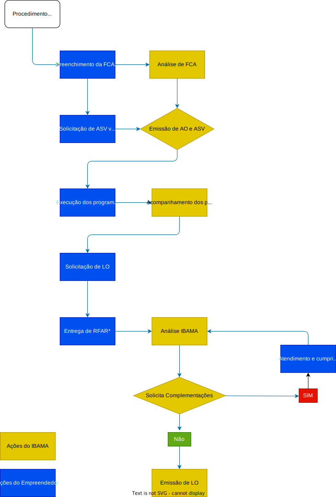

# Licenciamento Ambiental da Infraestrutura de Transportes

## Rodovias
Legislação específicas para o modal rodoviário

<table>
    <tr>
        <th>
            LEGISLAÇÃO ESPECÍFICA
        </th>
        <th>
            DESCRIÇÃO
        </th>
    </tr>
    <tr>
        <td>
            Portaria Interministerial MMA/MInfra nº 01/2020
        </td>
        <td>
            Dispõe sobre a regularização ambiental federal de Rodovias Federais pavimentadas.
        </td>
    </tr>
    <tr>
        <td>
            Instrução Normativa Ibama nº 13/2013
        </td>
        <td>
            Padronização metodológica dos planos de amostragem de fauna.
        </td>
    </tr>
</table>

### Procedimento Específico
A portaria MMA/INFRA nº 01/2020 estabelece procedimentos de licenciamento ambiental a serem utilizados pelo IBAMA, para proceder com a regularização de rodovias federais pavimentadas.

- A FCA e Requerimento de AO devem ser enviados via SEI (Sistema Eletrônico de Informação).
- Na impossibilidade de adequação do objeto ao enquadramento, na fase de análise da FCA, o IBAMA informará ao empreendedor o tipo de licenciamento adequado para aquela atividade ou empreendimento.
- Caso haja supressão de vegetação, deverá ser solicitada a Autorização de Supressão de Vegetação - ASV - via SINAFLOR
- **AO:** Autorização de Operação, cujo modelo de requerimento é anexo a Portaria.
- **RFAR:** Relatório Anual de Regularização Ambiental.

### ORGÃOS INTERVENIENTES
### PROGRAMAS AMBIENTAIS
### RELATÓRIO ANUAL DE REGULARIZAÇÃO AMBIENTAL (RARA)

## FERROVIAS

### Procedimento simplificado
### Atividades e obras de baixo potencial de impacto ambiental
### Licenciamento Ambiental Simplificado
### Atividades e obras vinculadas à Licença de Operação (LO)
### Unidades de Apoio
### Serviços e obras de rotina
### Atividades de Melhoramentos
### Obras Emergenciais
### Orientações Gerais

## Aeroportos

### Procedimento Simplificado – Ampliação e Construção de Aeroportos Regionais
### Enquadramento de Baixo Potencial de Impacto Ambiental
### Procedimento Simplificado
### Licença de Operação – Atividades que poderão ser autorizadas

## Portos

### Definições específicas
### Procedimento Específico
### Procedimento para Regularização Ambiental
### Outorgas de Direitos de Uso de Recursos Hídricos
### Outras autorizações
### Parecer da Marinha do Brasil – Diretoria de Portos e Costas/Capitania dos Portos
### Obras em Geral
### Cais, Molhes, Trapiches e Similares